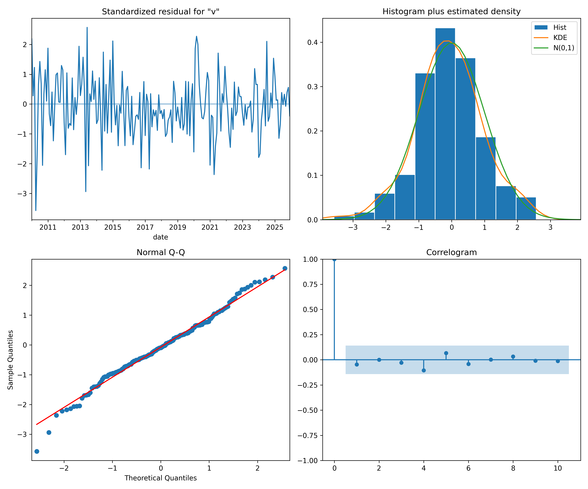

# Serii De Timp (Time Series Analysis)

Acest proiect conține seturi de date și instrumente pentru analiza seriilor de timp, concentrându-se pe date demografice și statistice (precum rata șomajului BIM și IPC).

## Structura Proiectului

- `documents/`: Conține seturile de date inițiale în format CSV.
  - `exportPivot_AMG157G.csv`: Date statistice pe grupe de vârstă și sexe.
  - `exportPivot_IPC102A.csv`: Date adiționale pentru analiză.

- `alex_holt_winters/`: Modul de analiză și prognoză folosind metode de netezire exponențială.
  - `main.py`: Script pentru Holt-Winters (Aditiv/Multiplicativ).
  - `rezultate/`: Grafice și erori (MAE, RMSE, MAPE).

- `arma_analysis/`: Modul pentru modelare ARMA/ARIMA conform metodologiei Box-Jenkins.
  - `main_arma.py`: Script pentru identificarea ordinului (p, d, q), estimare, diagnostic și prognoză.
  - `rezultate/`: Include grafice ACF/PACF, diagnosticarea reziduurilor și prognoza finală cu intervale de încredere.

## Rezultate și Vizualizări
### Modul ARMA
Conform solicitării, am implementat un model pur **ARMA (d=0)** pentru rata șomajului BIM. Modelul optim identificat prin Grid Search (AIC) este **ARMA(3, 3)**.

#### Verificări metodologice:
- **Stationaritate**: Deși seria originală este la limita nestaționarității (ADF p=0.58), rădăcinile AR ale modelului ARMA(3,3) sunt toate supraunitare (> 1), ceea ce indică un proces stabil în contextul modelului.
- **Invertibilitate**: Rădăcinile MA sunt toate supraunitare (> 1), confirmând că modelul este invertibil.
- **Validitate**: Reziduurile trec testul **Ljung-Box** (p = 0.75 > 0.05), deci nu există autocorelație reziduală (zgomot alb).
- **Precizie**: MAE ~0.31 pe setul de test (comparabil cu modelele mai complexe).

