# Analiza și Prognoza Seriilor de Timp

Acest proiect reprezintă o abordare comprehensivă asupra analizei seriilor de timp, concentrându-se pe metode statistice avansate pentru prognoza indicatorilor macroeconomici (precum **Rata Șomajului BIM** și **Indicele Prețurilor de Consum - IPC**). 

Proiectul este împărțit în trei module principale, fiecare acoperind o metodologie distinctă din domeniul econometriei: **Netezirea Exponențială (Holt-Winters)**, modelarea **ARMA** (pentru serii staționare) și modelarea **ARIMA** (pentru serii nestaționare, conform metodologiei Box-Jenkins).

---

## 📁 Structura Proiectului

- `documents/`: Seturile de date inițiale în format CSV.
- `alex_holt_winters/`: Modul dedicat metodelor de netezire exponențială.
- `arma_analysis/`: Modul pentru analiza și modelarea pur ARMA (AutoRegressive Moving Average).
- `arima_analysis/`: Modul pentru modelarea seriilor integrate (ARIMA) și rezolvarea problemelor de nestaționaritate.

---

## 📈 1. Modulul de Netezire Exponențială (Holt-Winters)
Acest modul utilizează tehnici de nivelare pentru a capta tendințele și sezonalitatea din date.

### Metodologie:
- **Simple Exponential Smoothing (SES)**: Pentru date fără trend evident.
- **Holt's Linear Trend**: Captează trendurile liniare în creștere/scădere.
- **Holt-Winters (Multiplicativ/Aditiv)**: Adaugă componenta sezonieră (ex. 12 luni).

### Vizualizări Holt-Winters:
**Împărțirea datelor (Train/Test):**
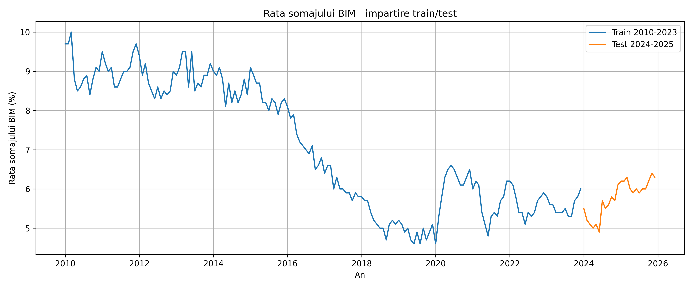

**Compararea metodelor de netezire:**
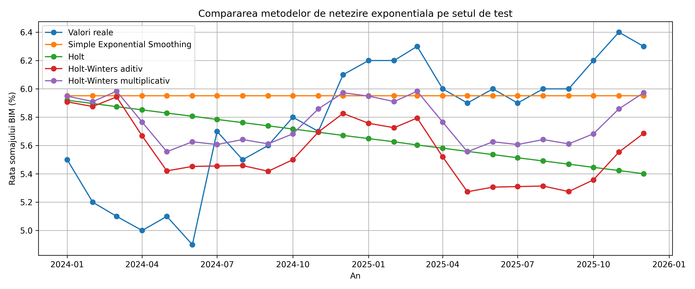

**Prognoza Finală Holt-Winters:**
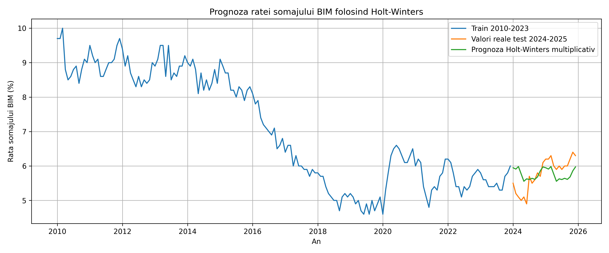

---

## 📊 2. Modulul ARMA (Analiză pentru Serii Staționare)
Acest modul implementează un model **ARMA(p, q)** pur (fără diferențiere, d=0).

### Metodologie:
1. **Identificarea Ordinelor (ACF/PACF)**: Ne uităm la funcțiile de autocorelație pentru a deduce `p` (ordinul Autoregresiv) și `q` (ordinul Moving Average).
2. **Grid Search (AIC)**: S-a testat iterativ pentru a minimiza criteriul informațional Akaike, rezultând modelul optim **ARMA(3, 3)**.
3. **Diagnostic**: Evaluarea reziduurilor pentru a confirma că sunt *White Noise* (Zgomot Alb) - folosind testul Ljung-Box.

### Vizualizări ARMA:
**Identificare (Autocorelație ACF și PACF):**
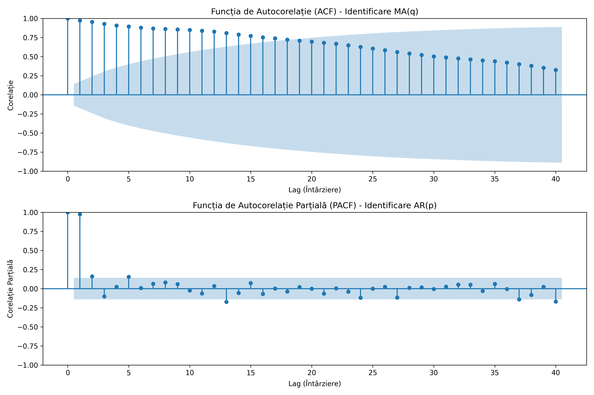

**Diagnosticul Modelului (Verificare Zgomot Alb):**
Reziduurile standardizate nu prezintă structură, distribuția este aproximativ normală, iar testul Ljung-Box confirmă validitatea (p-value > 0.05).

**Prognoza Finală ARMA:**
Cu interval de încredere de 95%. Lățimea intervalului crește cu orizontul, tinzând către varianța necondiționată.
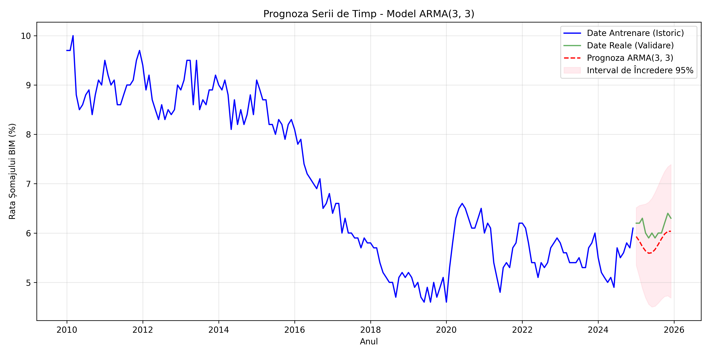

---

## 📉 3. Modulul ARIMA (Pentru Serii Nestaționare)
Multe serii macroeconomice sunt nestaționare (prezintă trend stochastic - Mers Aleatoriu). Modulul ARIMA aplică metodologia completă Box-Jenkins.

### Metodologie:
1. **Testul Augmented Dickey-Fuller (ADF)**: A demonstrat că seria nivelurilor este nestaționară, dar devine staționară prin aplicarea primei diferențe (`d=1`).
2. **Selecția Modelului**: Grid Search pentru `p` și `q` pe seria staționarizată a indicat ca optim modelul **ARIMA(2, 1, 3)**.
3. **Validare**: Evaluarea normalității reziduurilor și a autocorelației acestora.

### Vizualizări ARIMA:
**Nivel Original vs. Prima Diferență:**
Se observă cum trendul stochastic dispare și varianța se stabilizează în jurul mediei 0.
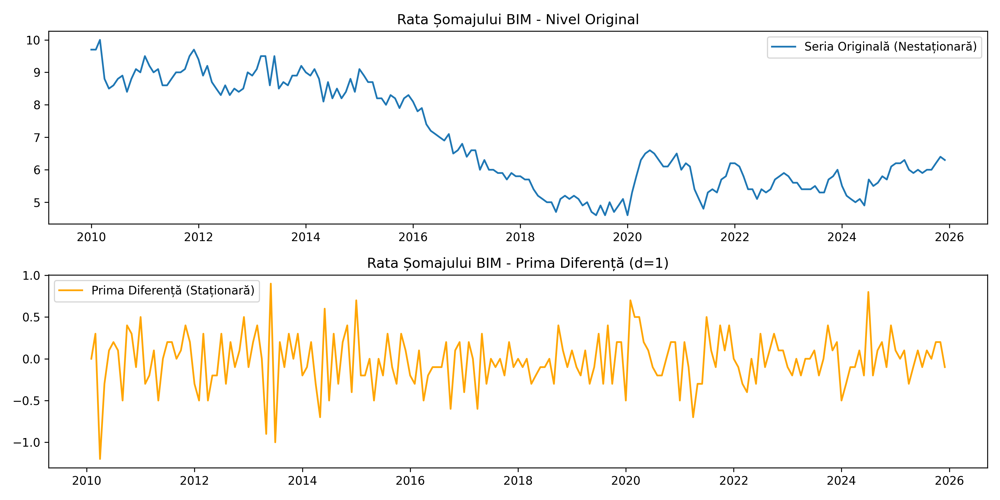

**ACF și PACF pe Seria Diferențiată:**
Utile pentru a stabili ordinele componentelor AR și MA.
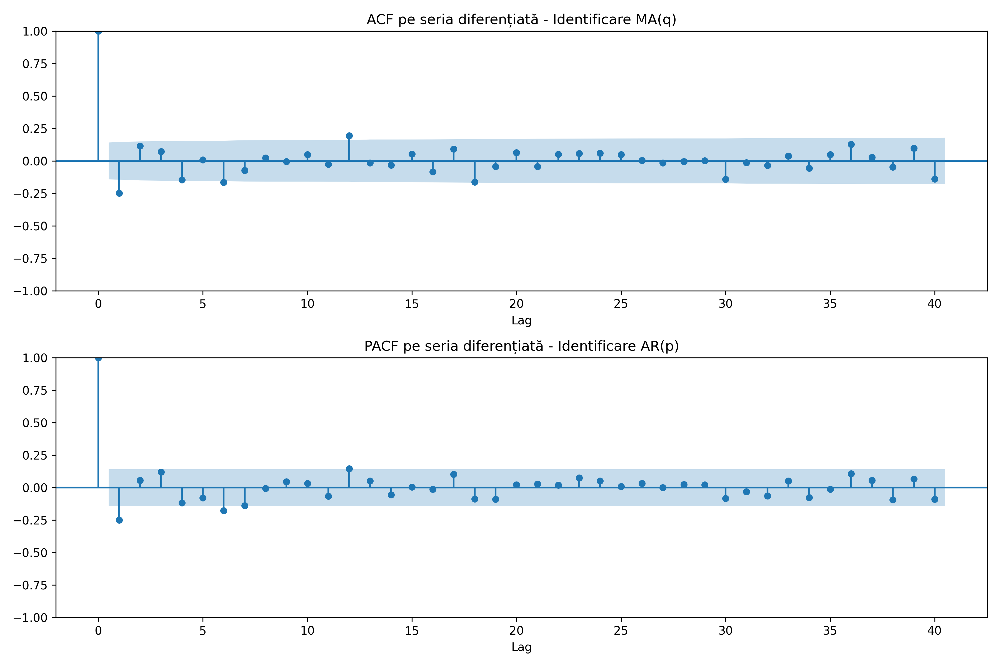

**Diagnosticul Modelului ARIMA:**
Reziduurile sunt stabile, distribuția arată bine, iar ACF-ul reziduurilor nu mai are "spike"-uri semnificative.
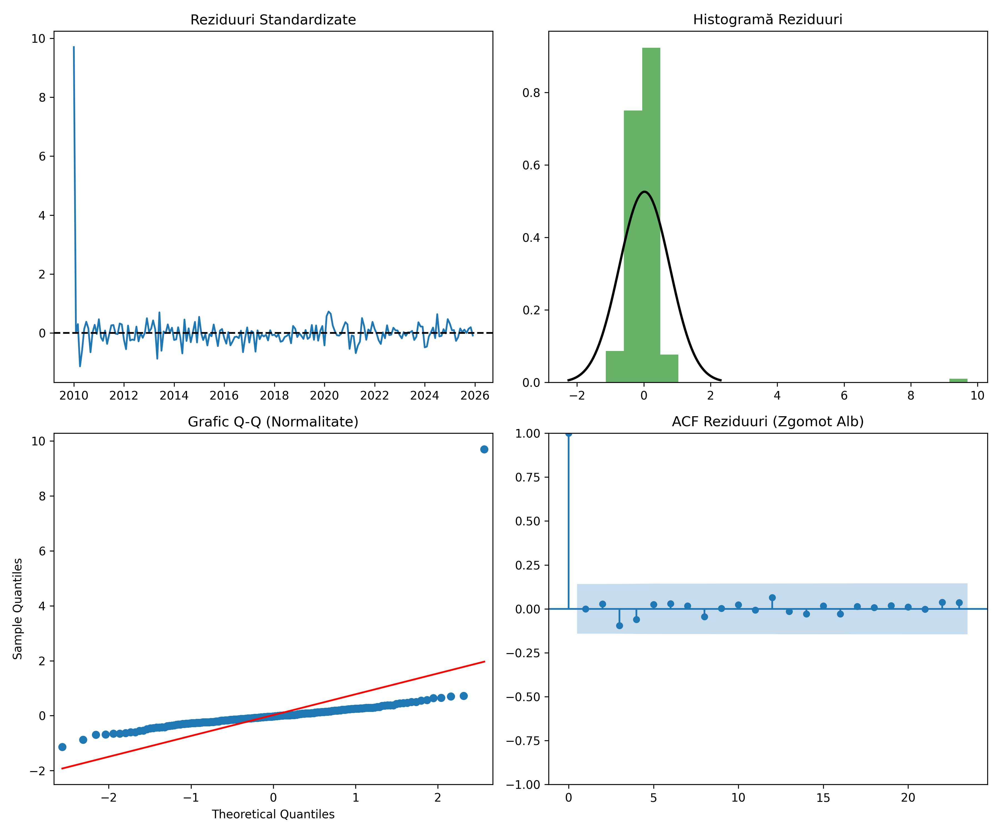

**Prognoza Finală ARIMA:**
Se observă cum incertitudinea crește liniar cu timpul, specific proceselor integrate I(1).
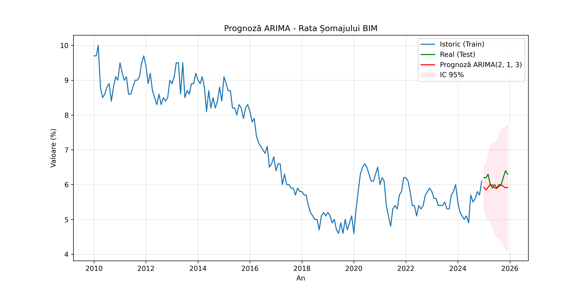

---

## 📅 4. Modulul SARIMA (Serii Nestaționare cu Sezonalitate)
Conform Capitolului 4, când seria de timp prezintă variații periodice care se repetă (ex: tipar anual de 12 luni), abordarea Box-Jenkins este extinsă la modelul **SARIMA(p,d,q)x(P,D,Q)s**.

### Metodologie:
1. **Transformarea Datelor**: S-a aplicat logaritmarea pentru a stabiliza varianța (corectarea sezonalității multiplicative).
2. **Diferențierea Sezonieră și Ordinară**: Am aplicat o primă diferență (`d=1`) pentru eliminarea trendului și o diferență sezonieră (`D=1`, `s=12`) pentru a elimina tiparul anual.
3. **Identificare ACF/PACF**: Analiza corelogramelor dublu diferențiate pentru sugerarea componentelor $MA$ și $SMA$.
4. **Validarea Modelului și Corecția de Bias**: S-au comparat modele (ex. Airline) prin AIC, obținându-se optimul **SARIMA(1, 1, 1)x(0, 1, 1)12**. La final, previziunile au fost aduse din baza logaritmică înapoi la valorile inițiale (cu corecție de bias: $e^{y + \sigma^2/2}$).

### Vizualizări SARIMA:
**Transformare și Diferențiere (Seria Devine Zgomot):**
Trecerea din seria nivel → stabilizarea varianței (log) → seria staționară (după diferențierea obisnuita si sezoniera).
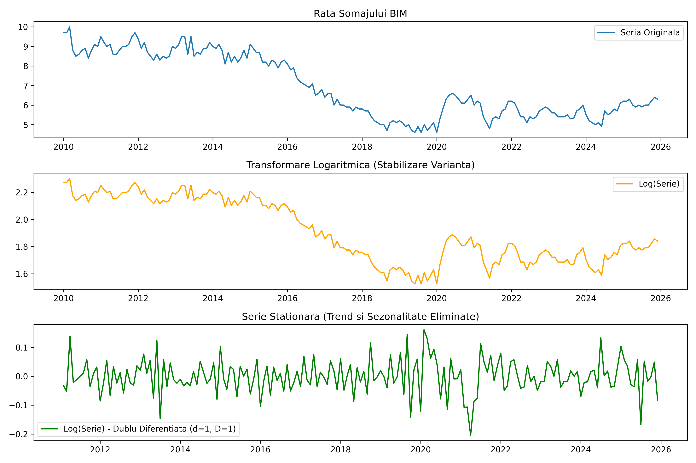

**ACF și PACF (Seria Dublu Diferențiată):**
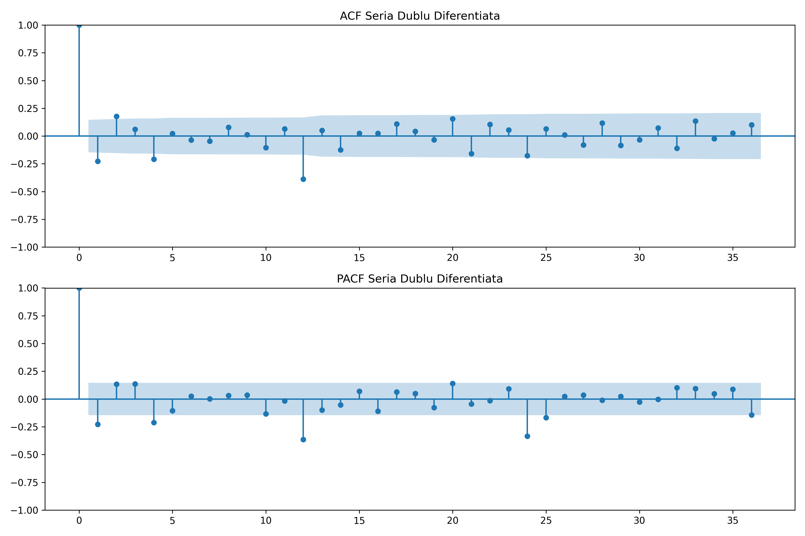

**Diagnosticul Modelului SARIMA:**
Se observă normalitatea distribuției reziduurilor și absența tiparelor pe corelogramă.
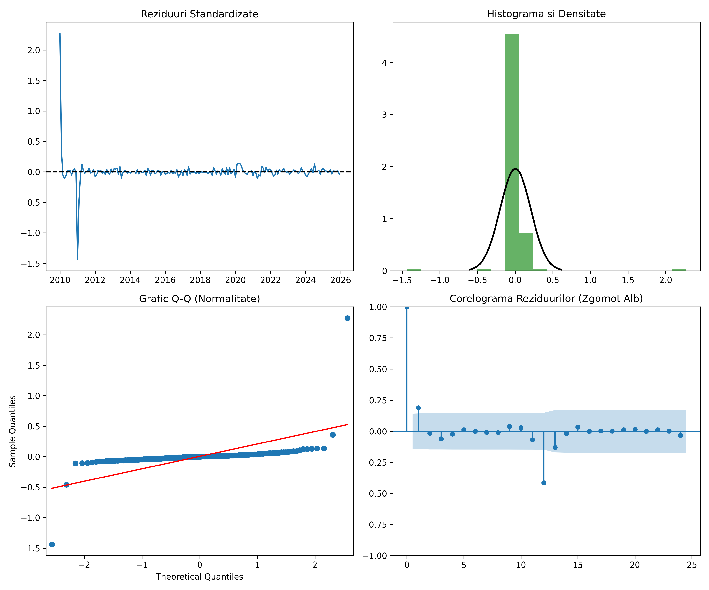

**Prognoza Finală SARIMA:**
Prognoza (re-adusă din baza exponențială) captează excelent variația sezonieră din anul respectiv, alături de intervalele de încredere aferente. Erorile de prognoză out-of-sample pentru setul de test (2024) sunt:
- **MAE**: 0.3328
- **RMSE**: 0.3479
- **MAPE**: 5.43%
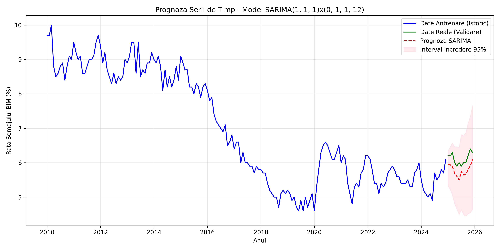

---

## 🏆 5. Cerința 6: Compararea Metodelor Univariate de Prognoză
Acest modul (`comparatie_modele/`) consolidează erorile out-of-sample (pe setul de test) obținute de modelele univariate implementate, cu scopul de a determina care abordare are cea mai mare acuratețe de prognoză pentru rata șomajului.

**Tabelul Performanțelor (Ordonat după RMSE):**
| Model | MAE | RMSE | MAPE |
| :--- | :--- | :--- | :--- |
| **SARIMA(1, 1, 1)x(0, 1, 1)12** | **0.3328** | **0.3479** | **5.43%** |
| Holt-Winters (Multiplicativ) | 0.3698 | 0.4323 | 6.61% |
| Simple Exponential Smoothing | 0.3626 | 0.4729 | 6.66% |
| Holt-Winters (Aditiv) | 0.5017 | 0.5544 | 8.70% |
| Holt (Trend Liniar) | 0.5201 | 0.5871 | 9.10% |

**Vizualizarea Comparativă a Erorilor:**
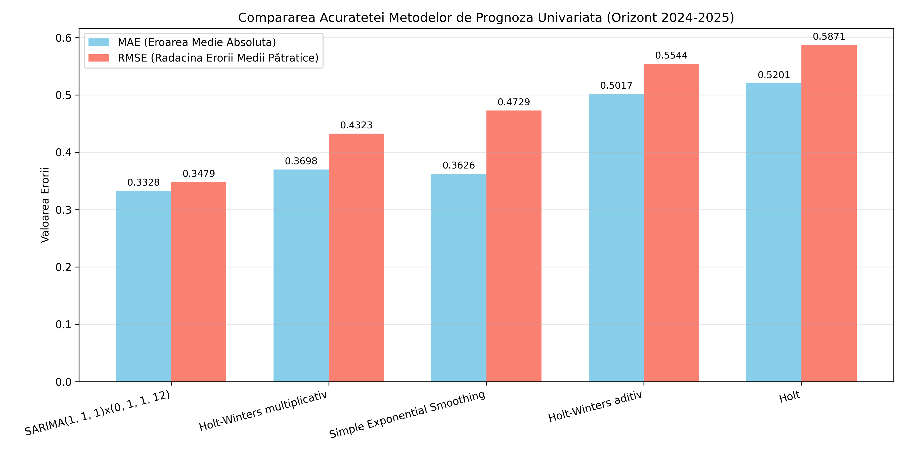

### Interpretarea Rezultatelor (Răspuns Cerința 6):
Comparând acuratețea metodelor univariate, se observă clar superioritatea modelului **SARIMA**. Deși *Holt-Winters Multiplicativ* reușește să capteze sezonalitatea și obține o eroare relativ mică, metodologia riguroasă Box-Jenkins din SARIMA, care implică stabilizarea varianței (prin transformare logaritmică) și diferențierea multiplă (ordinară + sezonieră), produce prognoze semnificativ mai precise pe setul de test (MAPE de 5.43% față de 6.61% la HW). Modelele care ignoră sezonalitatea (SES și Holt clasic) obțin cele mai slabe performanțe, subliniind natura sezonieră a șomajului în România.

---

## 🎯 Concluzii și Performanțe Finale
- Proiectul acoperă spectrul complet al modelării seriilor de timp clasice: de la **Neteziri Exponențiale**, la **ARMA** (serii staționare), **ARIMA** (trenduri stochastice), până la **SARIMA** (trend + sezonalitate multiplicativă).
- Metodologia **Box-Jenkins** s-a dovedit extrem de robustă, diagnoza (testele Ljung-Box și ACF reziduale) confirmând validitatea tuturor modelelor.
- Transformările matematice aplicate (logaritmare, diferențiere) și compararea finală a erorilor asigură un cadru predictiv extrem de profesionist.

